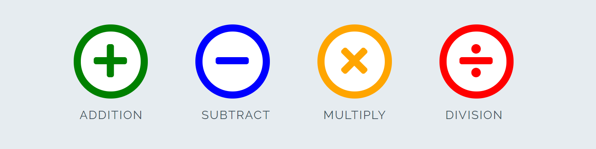
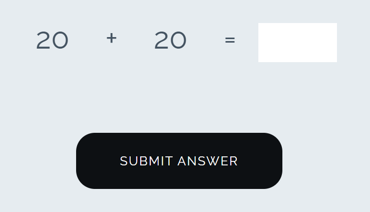

# Love Maths

[JavaScript Maths Game](https://flashdrag.github.io/love-maths) - Walkthrough project. Code Institute

Love Maths is a site that hopes to demonstrate how pure JavaScript works in a real-world context. The site will be targeted toward people who not only love to implement more advanced JavaScript concepts but also maths. Love Maths is a fully responsive JavaScript maths game that will allow users to add, subtract, multiply and divide numbers.

## Features

### Existing Features

- **The Love Maths Logo and Heading**

  - Featured at the top of the page, the Love Maths logo and heading is easy to see for the user. Upon viewing the page, the user will be able to see the name of the game.

- **The Game Area**

  - This section will allow the user to play the maths game. The user will be able to easily see icons for addition, subtraction, multiplication, and division games.
  - The user will be able to select the type of maths game they will be playing by clicking on the different icons.

- **The Question section**

  - The question section is where the user will be able to see the elementary arithmetic question to answer as part of the game. The user will be able answer the questions in the answer box provide
  - The user will be able to submit their answer and a pop-up will make it known to the user if they answered correctly.

- **The Score Area**

  - This section will allow the user to see exactly how many correct and incorrect answers they have provided.

### Features Left to Implement

...

## Testing

### Validator Testing

- HTML
  - No errors were returned when passing through the official [W3C validator](https://validator.w3.org/nu/?doc=https%3A%2F%2Fflashdrag.github.io%2Flove-maths%2F)
- CSS
  - No errors were found when passing through the official [(Jigsaw) validator](http://jigsaw.w3.org/css-validator/validator?lang=en&profile=css3svg&uri=https%3A%2F%2Fflashdrag.github.io%2Flove-maths%2F&usermedium=all&vextwarning=&warning=1)
- JavaScript
  - No errors were found when passing through the official [Jshint validator](https://jshint.com/)
    - The following metrics were returned:
    - There are 11 functions in this file.
    - Function with the largest signature takes 2 arguments, while the median is 0.
    - Largest function has 10 statements in it, while the median is 3.
    - The most complex function has a cyclomatic complexity value of 4 while the median is 2.

### Unfixed Bugs

...

## Deployment

- The site was deployed to GitHub pages. The steps to deploy are as follows:
  - In the GitHub repository, navigate to the Settings tab
  - From the source section drop-down menu, select the Master Branch
  - Once the master branch has been selected, the page will be automatically refreshed with a detailed ribbon display to indicate the successful deployment.

The live link can be found here - https://flashdrag.github.io/love-maths/

## Credits

The project was created based on tutorials of [Code Institute](https://codeinstitute.net/) course: Diploma in Full Stack Software Development
 
All used contents are from [Code Institute](https://codeinstitute.net) and [Code-Institute-Solutions](https://github.com/Code-Institute-Solutions)
